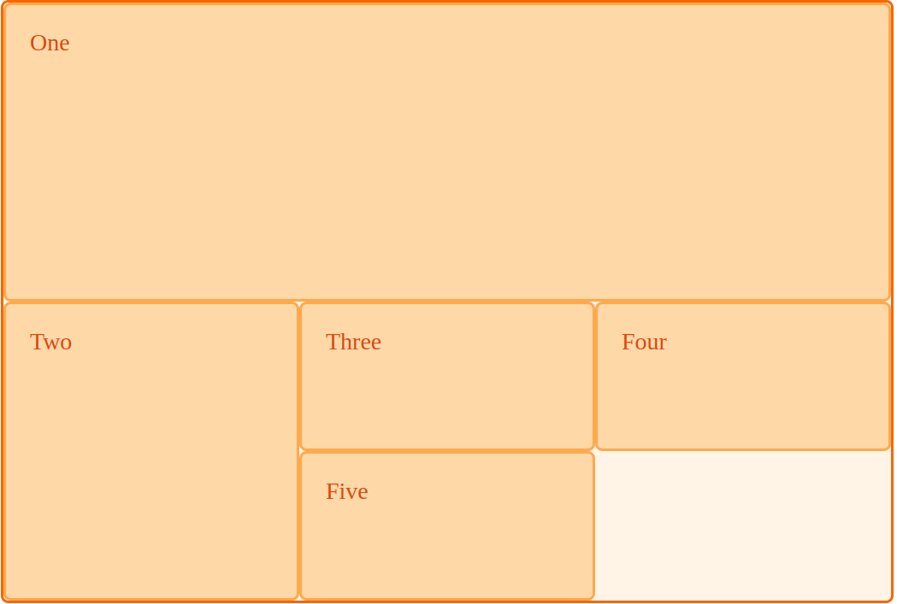
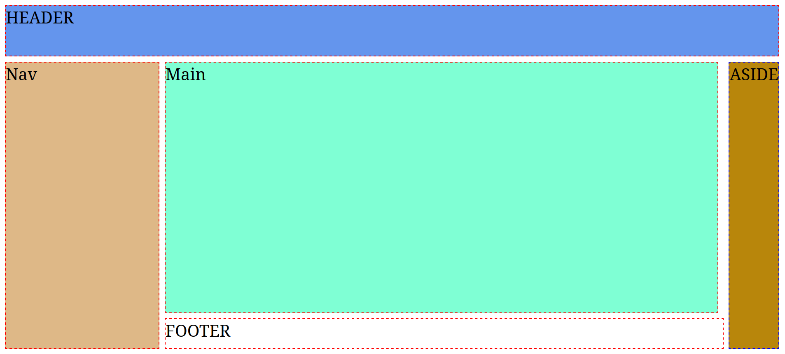

# Basic grid layout concepts 
[[toc]]

- source 1: 
(https://developer.mozilla.org/en-US/docs/Web/CSS/CSS_Grid_Layout/Basic_Concepts_of_Grid_Layout)

- source 2: 
https://developer.mozilla.org/en-US/docs/Learn/CSS/CSS_layout/Grids

- source 3: great tips about flex/grid layouts
https://defensivecss.dev/tip


- source 4: Grid Poster: use it as a reference when working with Grid layout.
https://css-tricks.com/wp-content/uploads/2022/02/css-grid-poster.png
- additional good resources:
  - https://css-tricks.com/snippets/css/complete-guide-grid/
  - https://learncssgrid.com/

## Basic Example: use this html code to create a grid with 3 200-px width column tracks 

```html
<div class="wrapper">
  <div>One</div>
  <div>Two</div>
  <div>Three</div>
  <div>Four</div>
  <div>Five</div>
</div>
```
- what is a `grid tracks`, and when it defines?
A track is the space between two grid lines. A row track is between two row lines and a column track between two column lines. When we create our grid we create these tracks by assigning a size to them.


- Example:  define a grid with three column tracks, two row tracks and a 10 pixel gap between the tracks as follows.

```css
.container {
    display: grid;
    grid-template-columns: 5em 100px 30%;
    /*auto:default for rows, means 'big as content' */
    grid-template-rows: 200px auto;
    gap: 10px;
}
```

## The fr unit and Unequal sizes: 

- create three equal width tracks that grow and shrink according to the available space.
- give 2 parts to the first track and one part each to the next two tracks.

## Mixing flexible and absolute sizes 

- what happen when you mix absolute sized tracks with fr units. The first track is 500 pixels?

## Intrinsic sizing keywords 

- grid tracks can use **intrinsic sizing keywords:
    - `min-content`: make a track as small as it can be without the track content overflowing. 
    - `max-content`: has the opposite effect. The track will become as wide enough for all of the content to display in one long unbroken string. This might cause overflows as the string will not wrap.
    - `fit-content()`:  **function** acts like max-content at first. However, once the track reaches the size that you pass into the function, the content starts to wrap. So fit-content(10em) will create a track that is less than 10em, if the max-content size is less than 10em, but never larger than 10em.


## Item placement 

- You can place items into a precise location on the grid using **lines ,area** and **names**


## Track listings with repeat() notation 

- use the `repeat()` notation to create a `grid` with an initial 20px track and repeating of 6 tracks then a final 20px track?
- grid will consist of 10 tracks, a 1fr track, and then followed by a 2fr track. This pattern will be repeated five times.

## Implicit and explicit grids 

- explain the differences and how control what happen when more grid tracks are needed? *(hint: `grid-auto-rows`,`grid-auto-columns`)*


## Track sizing and `minmax` 
- ensure that automatically created rows will be a minimum of 100 pixels tall, and a maximum of `auto`.
- what's `auto` means? *(hint: respect the content size,prevent overflow)*

## Grid Lines 

- Lines are numbered according to the writing mode of the document.
- how many lines in a grid with a 3 columns and 3 rows?

## Gutters (gaps) 

- create a 10px gap between columns and a 1em gap between rows.(*hint: target the container*)
- relation between flexible length `fr` tracks and spaces used by a gaps?

---

## Auto-fit Vs Auto-fill 

When using CSS grid `minmax()` function, it's important to decide between using the `auto-fit` or `auto-fill` keywords:

 - with `minmax()` function, the `auto-fit` keyword will expand the grid items to fill the available space (especially if there is only one grid item and `auto-fit` is used) . While `auto-fill` will keep the available space reserved without altering the grid items width.


<div class="note red bold">Note When use a css grid fixed values such (grid-template-columns:250px 1fr;) always use a media queries else this will break on small viewport sizes.</div>

--- 

## Minimum Content Size In CSS grid 

- Similar to flexbox, CSS grid has a default minimum content size for its child items which is auto. That means, if there is an element that is larger than the grid item (__for example: a long item content displayed as flex so it must be inline and the item grid will respect that due to its default size which it `auto`__), it will overflow and a horizontal scrolling bar will appeared.

- To fix that, we have three different solutions:
    1. Using `minmax()`
    2. Applying `min-width:0` to the grid item
    3. Adding overflow: hidden to the grid item


see details: https://defensivecss.dev/tip/grid-min-content-size/


---
## Fluid columns snippet 

Fluid width columns that break into more or less columns as space is available, with no media queries!

for example:

```css
.grid {
  display: grid;
  grid-template-columns: repeat(auto-fill, minmax(200px
  , 1fr));
  /* also try 'auto-fit' instead of 'auto-fill' ?
  /* This is better for small screens, once min() is 
  better supported */
  /* grid-template-columns: repeat(auto-fill,
         minmax(min(200px, 100%), 1fr)); */
  gap: 1rem;
}
```
> One of the common things that break a layout is using a **fixed** width or height with an element that has content in different lengths. Instead, use `min/max-height/width`

## Positioning items against lines 

- using following grid container:
```css
.wrapper {
  display: grid;
  grid-template-columns: repeat(3, 1fr);
  grid-auto-rows: 100px;
}
```

Write a code to modify a grid layout to be like this image:


(also try the shorthands `grid-row: x/z`,`grid-column: x/z`)

## Grid Cells 
- the smallest unit on a grid (looks like a table cell) and its the intersection of a grid `...` and a grid `...`

## Grid areas 
- A grid area is the logical space used to lay out one or more grid items.
- Consists of one or more `...`
- bounded by 4 `grid lines`, one for each size.
- can be named explicitly using the `grid-template-areas` of the **`grid container`**
- can be referenced implicitly by its bounding grid lines.
- a grid item is assigned to a grid area using the `grid-placement-properties(grid-column-start/end,grid-row-start/end)` or `grid-row,grid-column` shorthands.
- The `grid-area` CSS shorthand property specifies a grid item's size and location within a grid by contributing a line, a span, or nothing (automatic) to its grid placement, thereby specifying the edges of its grid area.

- practice: https://codepen.io/farisubuntu/pen/poxBGvQ


the final layout:

- We can create gaps (or hard “stops”) between cells using a dot `.` which means 'empty cell'
- Rows must have the same number of columns

- practice: click <a href="https://drafts.csswg.org/css-grid/#adapting-to-available-space" _blank alt="error">https://drafts.csswg.org/css-grid/#adapting-to-available-space</a>

- practice: Source-Order Independence (named area and `@media`) => see: https://drafts.csswg.org/css-grid/#source-independence for solution.

```css
@media(orientation:portrait){...}
@media(orientation:landscape){...}
```
goal:

<figure>
<figcaption>An arrangement suitable for “portrait” orientation.</figcaption>

</figure>

<figure><figcaption>An arrangement suitable for “landscape“ orientation.</figcaption>
</figure>

> tips: `grid-template-area`, each string "... ..." represents a `row` and each word inside the string is a column. number of rows equal to number of values given to `grid-template-rows` and the same for columns.

- practice: use `grid-row:x/y` and `grid-column:x/y` to implement grid using grid lines:
(https://codepen.io/farisubuntu/pen/WNaWPOY)

- the final layout: 
(https://mdn.github.io/learning-area/css/css-layout/grids/8-placement-starting-point.html)

## Image maximum width 

- Don't forget to set `max-width: 100%` to all images. This can be added to the CSS reset that you use:

```css
img {
    max-width: 100%;
    object-fit: cover;
}
```

## Position sticky with CSS Grid 

-  The default behavior for grid items is to `stretch`. As a result, the aside element in the example below is equal to the main section height.


to resolve this so it will looks like:


you need to reset `align-self` property:

```css
aside {
    align-self: start;
    position: sticky;
    top: 1rem;
}
```
see this example: 
https://codesandbox.io/s/position-sticky-with-css-grid-cqrjzw?file=/index.html

more about this topics:
https://ishadeed.com/article/position-sticky-css-grid/

---

- use `auto-fit` and `minmax(min,max)` with repeat to make a grid wrapped, for example:

```css
grid-template-columns: 
      repeat(auto-fit, minmax(200px, 1fr));
```

> Sometimes it's helpful to be able to ask grid to create as many columns as will fit into the container (**make a grid responsive**), then use `auto-fill` and `minmax()` together:

```css
.container {
  display: grid;
  grid-template-columns: repeat(auto-fill, 
                          minmax(200px, 1fr));
  grid-auto-rows: minmax(100px, auto);
  gap: 20px;
}
```

##### notes:
- `justify-items` (row-axis) the opposed to `align-items`(column-axis)
- 
## Nested grid and subgrid 
- The difference?

## Controlling the order 
- *Complete*: We can control the order in which items stack up by using the `...` property?

---

# Relationship of grid layout to other layout methods 

source: 
https://developer.mozilla.org/en-US/docs/Web/CSS/CSS_Grid_Layout/Relationship_of_Grid_Layout

## Grid and flexbox 
- The basic difference?
- when you wrap flex items, each new row (or column when working by column) is an independent flex line in the flex container. **Space distribution happens across the flex line.**
- 