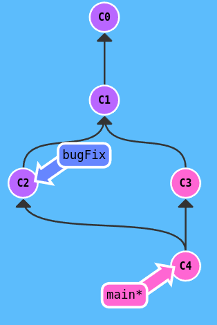

# Git And Git Branching
---

[[toc]]

+ Difference between `clone` and `fork`
    - `clone` is a `git` command but `fork` is a concept.
    - cloned repository changes can merged into master ONLY if you have write permission or added as a contributor by the owner whereas forked repository is a complete copy of the original repository that copied to your account and you must request a `pull request` to the owner that ask him to merge changes you made.

----------


- If you want all changes from master in dev_branch, then:
```bash
git checkout dev_branch
git reset --hard master
```

This only works if other people haven't cloned the repository.

- If you have dev_branch pushed to a remote already, you have to do:
```bash
git push --force
```

- To force-push to the remote. Warning: This will break the history of the branch for people who cloned it before! Then, other people will have to do a git pull --rebase on the dev_branch to get the changes.

---

### References and sources

- MDN github guide
- git tutorial: (https://www.toolsqa.com/git/branch-in-git/)
- git-flight-rules: (https://github.com/k88hudson/git-flight-rules)

---

# Git branching

[[toc]]


From: [Learngitbranching.org](https://learngitbranching.org)
To go straight to a sandbox: (https://pcottle.github.io/learnGitBranching/?NODEMO)


## Git Commits
- A **commit** in a git repository records a snapshot of all the (tracked) files in your directory. It's like a snapshot of the directory.
- most commits have ancestor commits above them

## Branches

- Branches: pointers to a specific commit and nothing more; says **I want to imclude the work of this commit and all parent commits**.

## Branching and Merging

- **branch off**: combining the work from two different branches together.

**The first method to **branch off** is `git merge`**

- Merging creates a special commit that has two unique parents which essentially means **I want to include all the work from this parent over here and this one over here, and the set of all their parents.
- below, two branches with a unique commit which means that neither branch includes the entire set of "work" in the repo that we have done.

<div class="img-wrapper"></div>

- when merge `git merge bugFix` into `main`, `main` now points to a new commit that has two parents which means that `main` contains all the work in ther repository now.
<div class="img-wrapper"></div>


- when merge `git merge main` into `bugFix`, `main` now points to a new commit that has two parents which means that `main` contains all the work in ther repository now.
<div class="img-wrapper"><p>before `git merge main`</p></div>
And since `bugFix` wan an ancestor of `main`, git simply just moved `bugFix` th the same commit `main` was attached to.
<div class="img-wrapper"><p>after `git merge main`</p></div>

**The second way of combining work between branches is _rebasing_ which essentially take a set of commits, "copies" them, and plops(يسقط) them down somewhere else.**


> While this sounds confusing, the advantage of rebasing is that it can be used to make a nice linear sequence of commits. The commit log / history of the repository will be a lot cleaner if only rebasing is allowed.
