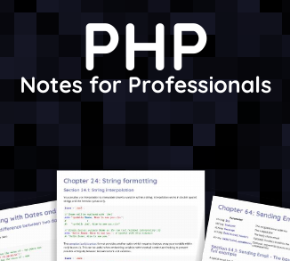

# Books

 

 

- [Download: Linux Quick Guide - dr0](./linux-guide_dr0.ch.pdf)

- [Website: Linux Quick Guide - dr0](https://dr0.ch/linux-guide/)

- [Download: PHP Notes For Proffesional](./PHPNotesForProfessionals.pdf)

- [Website: books.goalkicker.com](https://books.goalkicker.com/PHPBook/)

- [Download: Bash Notes For Proffesionals](./BashNotesForProfessionals.pdf)

- [Website: books.golakicker.com/bashbooks](https://goalkicker.com/BashBook/)

- [Download: Riptututorial - learn php](./riptutorial_com-php.pdf)

- [Website: Linux Quick Guide - dr0](https://riptutorial.com/php)

