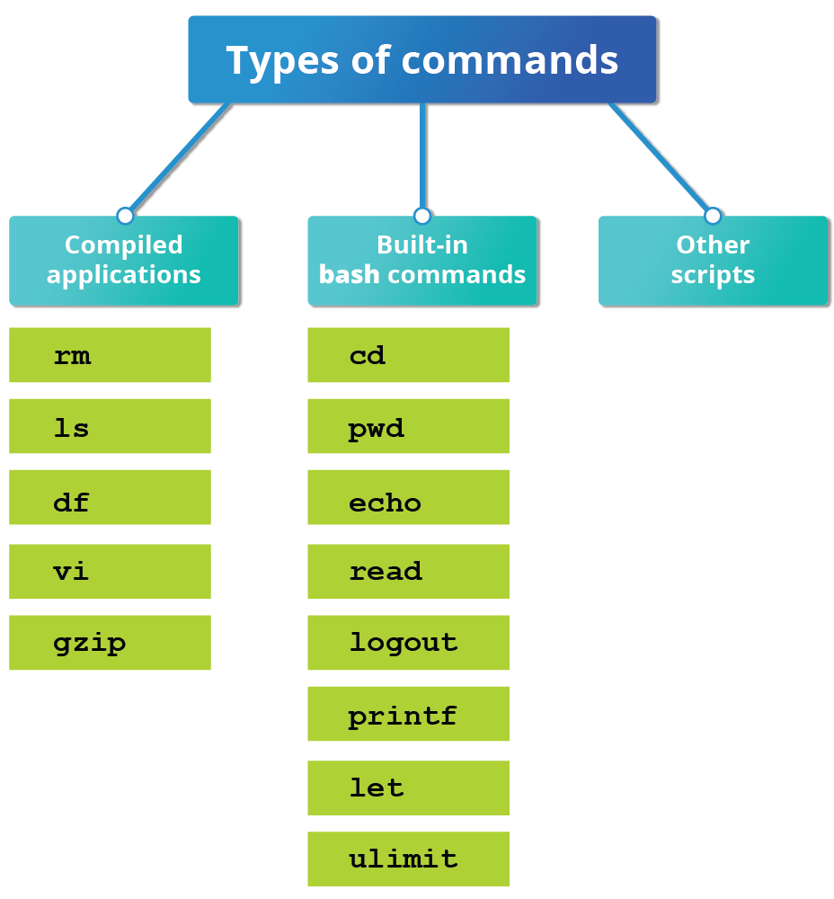

LinuxFoundationX LFS101x
# Introduction to Linux

## Chapter 15: The Bash Shell and Basic Scripting

- Commonly used interpreters include: /usr/bin/perl, /bin/bash, /bin/csh, /usr/bin/python and /bin/sh.
- Exactly what is available on the system is listed in /etc/shells. 
- History of Command Shells:
	- `sh`
	- `csh`
	- `tcsh`
	- `ksh`
	- `bash`: as full backward compatibility with `sh` and partial compatibility with `ksh`

> In all linux, `sh` just a link to `bash`.

- The first line of the script, which starts with `#!/bin/bash`
- `#!` called __shebang__

- Return values permit a process to monitor the exit state of another process, often in a parent-child relationship.

- By convention, success is returned as zero (0), and failure is returned as any non-zero value such as 2 if file not exist.
- the specific values that can be returned and their meanings are explained in the man page for the program as in section titled with **Exit status:...**

## Basic Syntax and Special Characters

The table lists some special character usages within bash scripts:

| Character	| Description |
|:---- |: -----------------------------------------------------------------------------|
|`#`	   | Used to add a comment, except when used as `\\#`, or as `#!` when starting a script|
|`\\`	   | Used at the end of a line to indicate continuation on to the next line, or to indicate that the next character is to be interpreted literally, as in \\$|
|`;`	   | Used to interpret what follows as a new command to be executed after completion of the current command|
|`$`	   | Indicates what follows is an environment variable|
|`>`	   | Redirect output|
|`>>`	   | Append output|
|`<`	   | Redirect input|
|`|`	   | Used to pipe the result into the next command|

## Putting Multiple Commands on a Single Line

3 ways:
- `;`  all anywhere
- `&&` if prev success 
- `||` until first success

-----

## Output Redirection

*TODO*: Write a command that sends the output of free to `/tmp/free.out`
*TODO*: difference between `>` and `>>` weather a file is existed or not.

## Input Redirection

- `wc` used to count number of lines,words and characters in a file.
*TODO*: 3 ways to shows lines of `/etc/passwd` file using `wc`,`cat`

## Shell Commands Types

commands can be: 

### 1. Compiled applications

- **compiled apps** are binary executable files
- usually in path such `/usr/bin` and many have the same name as bash built-in commands names (`/usr/bin/echo`)
### 2. Built-in bash commands
- can only be used to display the output within a terminal shell or shell script.
- include `cd, pwd, echo, read, logout, printf, let, time,` and `ulimit`.
### 3. Shell scripts or scripts from other interpreted languages, such as perl and Python.
- Always have access to applications in the default path, such as
 ` rm, ls, df, vi,` and `gzip`, which are programs compiled from lower-level
  programming languages such as `C`.

- **TODO**: type `help` in bash command line will ...

## Script Parameters

- can be text or numbers
- Within a script, the parameter or an argument is represented with a $ and
  a number or special character.

| Parameter | Meaning |
|:-------- |:--------------|
|$0 	   |Script name|
|$1 	   |First parameter|
|$2,$3,... |Second, third parameter, etc.|
|$* 	   |All parameters|
|$# 	   |Number of arguments|

**TODO**: write script that print its name,all parameters, number of arguments passed to it.

## Command Substitution(استبدال / نيبة)

**TODO**: What's **substitution**?

Sometime you may need to substitute the result of a command as a portion of another command. 

It can be done in two ways:

 - By enclosing the inner command in `$( )` method
 - By enclosing the inner command with backticks `(`)` (backticks is deprecated)

## Environment Variables

You can view and set the value of environment variables.
`$ echo $VAR`
`$ VAR=blue # no prefix required

You can get a list of environment variables with the `env, set`, or `printenv` commands.

## Exporting Environment Variables

By default, the variables created within a script are available only to the subsequent steps of that script. Any child processes (sub-shells) do not have automatic access to the values of these variables. To make them available to child processes, they must be promoted to environment variables using the export statement, as in:

`$ export VAR=value`
or
`$ VAR=value ; export VAR`

**Exported variables are not shared, they are only copied and inherited.**

